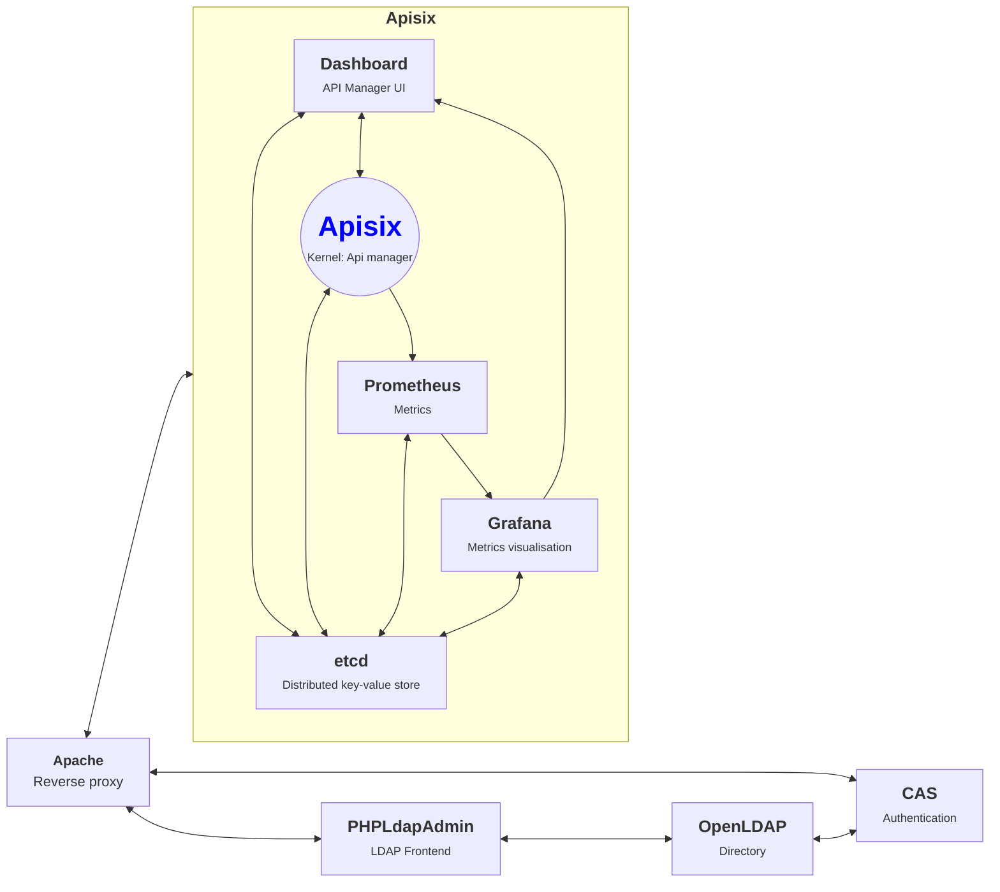

# Development Environment - srv-dev
The repository can be used to install the services and all the development environment for the Avenirs-ESR's ePortfolio.

It is based on bash scripts for bootstraping and cleaning and a main docker compose file that includes a docker compose file for each service to deploy.
The main bootstrap script will invoque the bootstrap script for each service. A service bootstrap script may create the docker volumes on file system, 
check the branch (if a git submodule), and create a .env file to propagate the settings.

## Prerequisites
Git, Docker (tested with 24.0.6) and docker-compose >=2.2.0 for the support of "include".

## Docker Containers

## Tree structure

<pre>
. 
├── docker-compose.yml              Main docker compose file
├── scripts                         Main Scripts directory
│   ├── srv-dev-bootstrap.sh        Main bootsrapping script
│   ├── srv-dev-clean.sh            Removes all the bootstrap modifications
│   ├── srv-dev-commons.sh          Helpers and constants for the bash scripts
│   └── srv-dev-env.sh              Main environment file : can override the services environment files.
└── services
    ├── apisix
    │   ├── apisix-docker           git submodule: https://github.com/apache/apisix-docker.git
    │   ├── avenirs-apisix-overlay
    │   │   └── example
    │   │       └── docker-compose.yml
    │   └──  scripts                       
    │           ├── apisix-bootstrap.sh     Apisix bootsrapping script
    │           ├── apisix-clean.sh         Reverts Apisix bootstrapping
    │           └── apisix-env.sh           Apisix environment file
    │
    ├── apache                              Proxy for the docker containers
    │        ├── apache-files
    │        │    ├── conf
    │        │    │    ├── extra   
    │        │    │    │    ├── avenirs.conf     Proxy rules
    │        │    │    │    └── httpd-ssl.conf
│   │        │    │    └── httpd.conf
    │        │    └── htdocs
    │        └── scripts
    │  
    ├── cas
    │   ├── avenirs-cas-overlay     git submodule: https://github.com/apereo/cas-overlay-template.git 
    │   │   ├── build.gradle
    │   │   ├── docker-compose.yml
    │   │   ├── Dockerfile
    │   │   ├── entrypoint.sh
    │   │   └── etc
    │   │       └── cas
    │   │           ├── config
    │   │           │   ├── cas.properties
    │   │           │   └── log4j2.xml
    │   │           ├── services
    │   │           │   ├── all-1649925263.json
    │   │           │   └── apim-4000.json
    │   │           └── thekeystore
    │   ├── cas-overlay-template
    │   └── scripts
    └── openldap                    custom container based on osixia's images
        ├── doc
        ├── fixtures
        └── scripts
</pre>

## Scripts
The scripts are located in the folders "scripts"; in the root for the main one, and in each service directory for specific ones.
The services' scripts can be executed via the main ones: srv-dev-bootstrap or srv-dev-clean.sh or individually directly.

# Local installation quick start

**Fetches the repository**
<pre>
git clone git@github.com:avenirs-esr/srv-dev.git --recurse
cd srv-dev/
npm i
</pre>

**Bootstrapping**
<pre>
 ./scripts/srv-dev-bootstap.sh -v
</pre>

**Build and lanches the docker images**
<pre>
docker-compose up --build -d
</pre>

Several containers should be deployed and running:

<pre>
$ docker ps
CONTAINER ID   IMAGE                        COMMAND                  CREATED      STATUS      PORTS                             NAMES
26af756ed65d   apache-le-apache             "httpd-foreground"       2 days ago   Up 2 days   0.0.0.0:80->80/tcp,               apache
                                                                                              :::80->80/tcp, 
                                                                                              0.0.0.0:443->443/tcp, 
                                                                                              :::443->443/tcp

15105354c245   osixia/phpldapadmin:latest   "/container/tool/run"    2 days ago   Up 2 days   443/tcp, 0.0.0.0:8080->80/tcp,    ldapadmin 
                                                                                              :::8080->80/tcp 

8217143735e2   apache/apisix:3.6.0-debian   "/docker-entrypoint.…"   2 days ago   Up 2 days   0.0.0.0:9080->9080/tcp,           apisix
                                                                                              :::9080->9080/tcp, 
                                                                                              0.0.0.0:9091-9092->9091-9092/tcp, 
                                                                                              :::9091-9092->9091-9092/tcp, 
                                                                                              0.0.0.0:9180->9180/tcp, 
                                                                                              :::9180->9180/tcp, 
                                                                                              0.0.0.0:9443->9443/tcp, 
                                                                                              :::9443->9443/tcp   

38dbbc0caea3   prom/prometheus:v2.25.0      "/bin/prometheus --c…"   2 days ago   Up 2 days   0.0.0.0:9090->9090/tcp,           apisix_prometheus
                                                                                              :::9090->9090/tcp
                                                                                                                                                                                                                                                      
aecb067e65dc   grafana/grafana:7.3.7        "/run.sh"                2 days ago   Up 2 days   0.0.0.0:3000->3000/tcp,           apisix_grafana
                                                                                              :::3000->3000/tcp
                                                                                                                                                                                                                                                      
7e6ef9e8423d   srv-dev-cas                  "java -server -nover…"   2 days ago   Up 2 days   0.0.0.0:8443->8443/tcp,           cas 
                                                                                              :::8443->8443/tcp, 
                                                                                              0.0.0.0:8081->8080/tcp, 
                                                                                              :::8081->8080/tcp
                                                                                                                                                                                                           
836c3be31027   bitnami/etcd:3.4.15          "/opt/bitnami/script…"   2 days ago   Up 2 days   0.0.0.0:2379->2379/tcp,          apisix_etcd
                                                                                              :::2379->2379/tcp, 
                                                                                              2380/tcp
                                                                                                                        
f09872ea87d8   osixia/openldap:1.5.0        "/container/tool/run"    2 days ago   Up 2 days   0.0.0.0:389->389/tcp,           openldap
                                                                                              :::389->389/tcp, 
                                                                                              0.0.0.0:636->636/tcp, 
                                                                                              :::636->636/tcp                                                                                              
                                                                                                                                                                                                                                                                           
</pre>

## End-points

- `http://<server>/grafana/`
- `http://<server>/cas` -> e.g.:  `http://<server\>/cas/login` 

# Distant deployment

WIP...
Creation of the contexts
  docker context create env --docker host=ssh://arnaud@srv-dev-avenirs --default-stack-orchestrator=swarm

